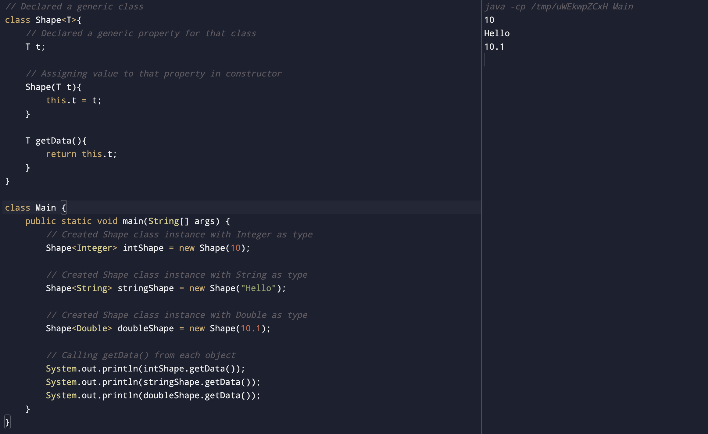

#### Write a Java Program to demonstrate a Generic Class and Generic Methods.

##### Code

```
class Shape<T>{
    // Declared a generic property for that class
    T t;

    // Assigning value to that property in constructor
    Shape(T t){
        this.t = t;
    }

    T getData(){
        return this.t;
    }
}

class Main {
    public static void main(String[] args) {
        // Created Shape class instance with Integer as type
        Shape<Integer> intShape = new Shape(10);

        // Created Shape class instance with String as type
        Shape<String> stringShape = new Shape("Hello");

        // Created Shape class instance with Double as type
        Shape<Double> doubleShape = new Shape(10.1);

        // Calling getData() from each object
        System.out.println(intShape.getData());

        System.out.println(stringShape.getData());

        System.out.println(doubleShape.getData());
    }
}
```

##### Output


