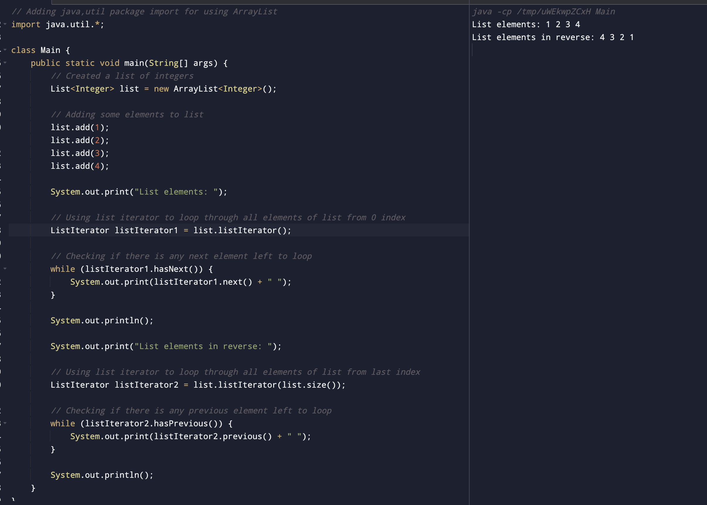

#### Write a Java program to create List containing list of items and use ListIterator interface to print items present in the list. Also print the list in reverse/backward direction.

##### Code (Method 1)

```
// Adding java,util package import for using ArrayList
import java.util.*;

class Main {
    public static void main(String[] args) {
        // Created a list of integers
        List<Integer> list = new ArrayList<Integer>();

        // Adding some elements to list
        list.add(1);
        list.add(2);
        list.add(3);
        list.add(4);

        System.out.print("List elements: ");

        // Looping through all elements of list from 0 index
        for(int i = 0; i < list.size(); i++){
            System.out.print(list.get(i) + " ");
        }

        System.out.println();

        System.out.print("List elements in reverse: ");

        // Looping through all elements of list from list index
        for(int i = list.size() - 1; i >= 0; i--){
            System.out.print(list.get(i) + " ");
        }

        System.out.println();
    }
}
```

##### Output


##### Code (Method 2)

```
// Adding java,util package import for using ArrayList
import java.util.*;

class Main {
    public static void main(String[] args) {
        // Created a list of integers
        List<Integer> list = new ArrayList<Integer>();

        // Adding some elements to list
        list.add(1);
        list.add(2);
        list.add(3);
        list.add(4);

        System.out.print("List elements: ");

        // Using list iterator to loop through all elements of list from 0 index
        ListIterator listIterator1 = list.listIterator();

        // Checking if there is any next element left to loop
        while (listIterator1.hasNext()) {
            System.out.print(listIterator1.next() + " ");
        }

        System.out.println();

        System.out.print("List elements in reverse: ");

        // Using list iterator to loop through all elements of list from last index
        ListIterator listIterator2 = list.listIterator(list.size());

        // Checking if there is any previous element left to loop
        while (listIterator2.hasPrevious()) {
            System.out.print(listIterator2.previous() + " ");
        }

        System.out.println();
    }
}
```

##### Output


