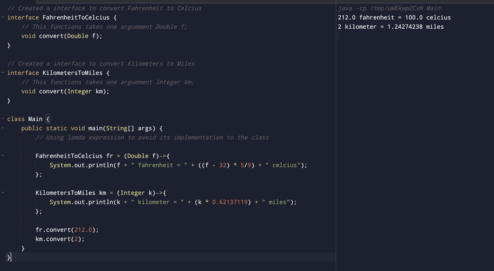

#### Write a Java program using Lambda Expression to calculate the following:

###### a. Convert Fahrenheit to Celcius

###### b. Convert Kilometers to Miles.

##### Code

```
// Created a interface to convert Fahrenheit to Celcius
interface FahrenheitToCelcius {
    // This functions takes one arguement Double f;
    void convert(Double f);
}

// Created a interface to convert Kilometers to Miles
interface KilometersToMiles {
    // This functions takes one arguement Integer km;
    void convert(Integer km);
}

class Main {
    public static void main(String[] args) {
        // Using lamda expression to avoid its implementation to the class

        FahrenheitToCelcius fr = (Double f)->{
            System.out.println(f + " fahrenheit = " + ((f - 32) * 5/9) + " celcius");
        };

        KilometersToMiles km = (Integer k)->{
            System.out.println(k + " kilometer = " + (k * 0.62137119) + " miles");
        };

        fr.convert(212.0);
        km.convert(2);
    }
}
```

##### Output


