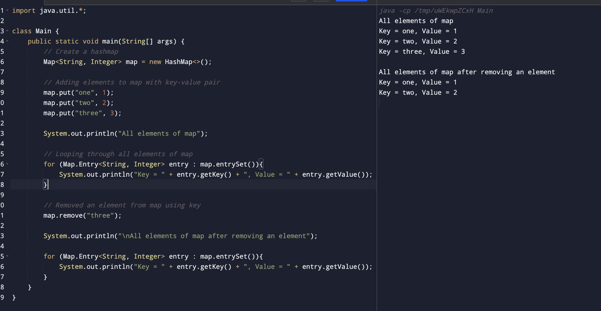

#### Write a java program using Map interface containing list of items having keys and associated values and perform the following operations:

###### a. Add items in the map

###### b. Remove items from the map.

##### Code

```
import java.util.*;

class Main {
    public static void main(String[] args) {
        // Create a hashmap
        Map<String, Integer> map = new HashMap<>();

        // Adding elements to map with key-value pair
        map.put("one", 1);
        map.put("two", 2);
        map.put("three", 3);

        System.out.println("All elements of map");

        // Looping through all elements of map
        for (Map.Entry<String, Integer> entry : map.entrySet()){
            System.out.println("Key = " + entry.getKey() + ", Value = " + entry.getValue());
        }

        // Removed an element from map using key
        map.remove("three");

        System.out.println("\nAll elements of map after removing an element");

        for (Map.Entry<String, Integer> entry : map.entrySet()){
            System.out.println("Key = " + entry.getKey() + ", Value = " + entry.getValue());
        }
    }
}
```

##### Output


