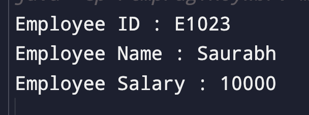

#### Write a program to create Java POJO class:

##### Code

```
class Employee {
    public String id;
    public String name;
    public Integer salary;

    public String getId(){
        return this.id;
    }

    public String getName(){
        return this.name;
    }

    public Integer getSalary(){
        return this.salary;
    }

    public void setId(String id){
        this.id = id;
    }

    public void setName(String name){
        this.name = name;
    }

    public void setSalary(Integer salary){
        this.salary = salary;
    }
}

class Main{
    public static void main(String[] args){
        Employee employee = new Employee();

        employee.setId("E1023");
        employee.setName("Saurabh");
        employee.setSalary(10000);

        System.out.println("Employee ID : " + employee.getId());
        System.out.println("Employee Name : " + employee.getName());
        System.out.println("Employee Salary : " + employee.getSalary());
    }
}
```

##### Output


