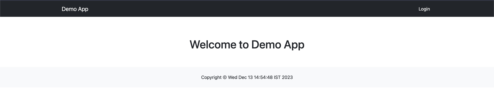
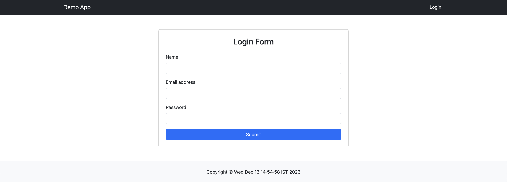
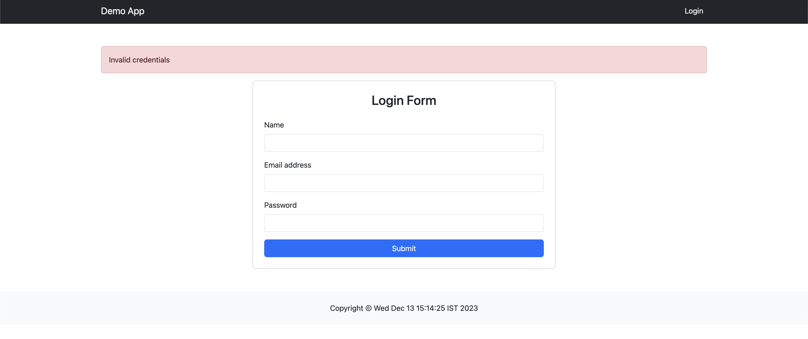
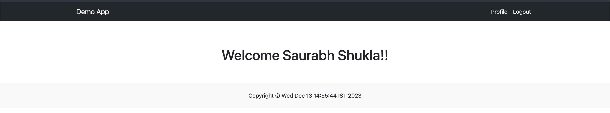
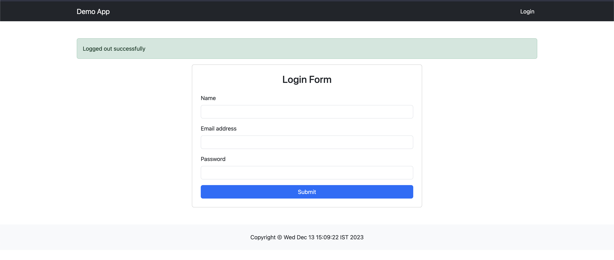

#### Write a JSP page to display the Registration form (Make your own assumptions)

##### Installation and setup process

1. Visit the site https://www.eclipse.org/downloads/packages/, to download the Eclipse IDE
2. Visit the site https://tomcat.apache.org/download-90.cgi, to download the Tomcat server
3. Install both
4. To link tomcat and eclipse click on the Server tab
   a. If Server tab is not visible, click on File > New > Other > Search for Server and add it
5. Configure the tomcat by choosing appropriate file path
6. Start the server
   a. If there is an 404 error on webpage, double click tomcat on server tab
   b. Select check the "Tomcat Installation" radio button
   c. Restart the server

##### This includes lots of files

##### Code

```
// index.jsp

<%@ page language="java" contentType="text/html; charset=UTF-8" pageEncoding="UTF-8"%>
<!DOCTYPE html>
<html>
    <head>
        <meta charset="UTF-8">
        <title>Demo App</title>
        <link href="https://cdn.jsdelivr.net/npm/bootstrap@5.3.2/dist/css/bootstrap.min.css" rel="stylesheet">
        <style>
            .text-w{
                color: white !important;
            }
            .nav-link{
                color: white !important;
            }
        </style>
    </head>
    <body>

        <jsp:include page="./components/header.jsp" />

        <section class="py-5">
            <h1 class="text-center mt-4">Welcome to Demo App</h1>
        </section>

        <jsp:include page="./components/footer.jsp" />

    </body>
</html>
```



```
// components/header.jsp

<nav class="navbar navbar-expand-lg bg-dark">
  <div class="container text-w">
    <a class="navbar-brand text-w" href="index.jsp">Demo App</a>
    <div class="ms-auto">
      <ul class="navbar-nav me-auto mb-2 mb-lg-0">

        <% if((session.getAttribute("loggedIn") != null && (boolean) session.getAttribute("loggedIn"))) { %>
	        <li class="nav-item">
	          <a class="nav-link" href="profile.jsp">Profile</a>
	        </li>
	        <li class="nav-item">
		        <form id="logout-form" method="post" action="logoutAction.jsp">
				</form>
	          <a class="nav-link" href="javascript:void(0)" onclick="document.querySelector('#logout-form').submit()">Logout</a>
	        </li>
        <% } else { %>
	        <li class="nav-item">
	          <a class="nav-link" aria-current="page" href="login.jsp">Login</a>
	        </li>
        <% } %>
      </ul>
    </div>
  </div>
</nav>
```

```
// components/footer.jsp

<footer class="p-4 text-center bg-light">
	Copyright &copy; <%= new java.util.Date() %>
</footer>
```

```
// login.jsp

<%@ page language="java" contentType="text/html; charset=UTF-8" pageEncoding="UTF-8"%>
<!DOCTYPE html>
<html>
    <head>
        <meta charset="UTF-8">
        <title>Demo App</title>
        <link href="https://cdn.jsdelivr.net/npm/bootstrap@5.3.2/dist/css/bootstrap.min.css" rel="stylesheet">
        <style>
            .text-w{
                color: white !important;
            }
            .nav-link{
                color: white !important;
            }
            form{
                max-width: 50%;
                margin: 0 auto;
            }
            @media (max-width: 996px){
                form{
                    max-width: 100%;
                }
            }
        </style>
    </head>
    <body>

        <%
            if((session.getAttribute("loggedIn") != null && (boolean) session.getAttribute("loggedIn"))){
                response.sendRedirect("profile.jsp");
            }
        %>


        <jsp:include page="./components/header.jsp" />

        <section class="py-5">


            <div class="container mx-auto">
                <% if(session.getAttribute("error") != null) { %>
                    <div class="alert alert-danger" role="alert">
                        <%= session.getAttribute("error") %>
                    </div>
                <% } %>

                <% if(session.getAttribute("success") != null) { %>
                    <div class="alert alert-success" role="alert">
                        <%= session.getAttribute("success") %>
                    </div>
                <% } %>

                <form class="card p-4" method="post" action="loginAction.jsp">
                    <h3 class="h3 text-center mb-4">Login Form</h3>

                    <div class="mb-3">
                        <label for="name" class="form-label">Name</label>
                        <input type="text" class="form-control" id="name" name="name" required autofocus />
                    </div>

                    <div class="mb-3">
                        <label for="email" class="form-label">Email address</label>
                        <input type="email" class="form-control" id="email" name="email" required />
                    </div>

                    <div class="mb-3">
                        <label for="password" class="form-label">Password</label>
                        <input type="password" class="form-control" id="password" name="password" required />
                    </div>

                    <button type="submit" class="btn btn-primary">Submit</button>

                </form>

            </div>
        </section>

        <jsp:include page="./components/footer.jsp" />

    </body>
</html>
```





```
// loginAction.jsp

<%
	String name = request.getParameter("name");
	String email = request.getParameter("email");
	String password = request.getParameter("password");

	session.removeAttribute("error");
	session.removeAttribute("success");

	if(email.equals("admin@gmail.com") && password.equals("admin")){
		session.setAttribute("loggedIn", true);
		session.setAttribute("username", name);

		response.sendRedirect("profile.jsp");
	} else {
		session.setAttribute("error", "Invalid credentials");
		session.setMaxInactiveInterval(1);

		response.sendRedirect("login.jsp");
	}
%>
```

```
// profile.jsp

<%@ page language="java" contentType="text/html; charset=UTF-8" pageEncoding="UTF-8"%>
<!DOCTYPE html>
<html>
    <head>
        <meta charset="UTF-8">
        <title>Demo App</title>
        <link href="https://cdn.jsdelivr.net/npm/bootstrap@5.3.2/dist/css/bootstrap.min.css" rel="stylesheet">
        <style>
            .text-w{
                color: white !important;
            }
            .nav-link{
                color: white !important;
            }
            form{
                max-width: 50%;
                margin: 0 auto;
            }
            @media (max-width: 996px){
                form{
                    max-width: 100%;
                }
            }
        </style>
    </head>
    <body>

        <%
            if(!(session.getAttribute("loggedIn") != null && (boolean) session.getAttribute("loggedIn"))){
                response.sendRedirect("login.jsp");
            }
        %>

        <jsp:include page="./components/header.jsp" />

        <section class="py-5">
            <h1 class="text-center mt-4">Welcome <%= session.getAttribute("username") %>!!</h1>
        </section>

        <jsp:include page="./components/footer.jsp" />

    </body>
</html>
```



```
// logoutAction.jsp

<%
	session.removeAttribute("loggedIn");
	session.removeAttribute("username");

	session.setAttribute("success", "Logged out successfully");
	session.setMaxInactiveInterval(1);

	response.sendRedirect("login.jsp");
%>
```


