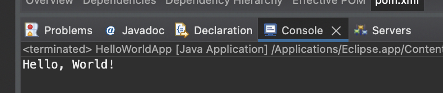

#### Write a program to print “Hello World” using spring framework.

##### Steps to create files

1. Open Eclipse IDE.
2. Go to File -> New -> Other....
3. Select Maven -> Maven Project and click Next.
4. Choose the option Create a simple project (skip archetype selection) and click Next.
5. Enter the Group Id (e.g., com.example) and Artifact Id (e.g., spring-hello-world) for your project. Click Finish.
6. Add this code to `pom.xml` file

```
<dependencies>
    <dependency>
        <groupId>org.springframework</groupId>
        <artifactId>spring-context</artifactId>
        <version>5.3.9</version> <!-- Replace with the latest version -->
    </dependency>
</dependencies>
```

##### Code

```
Create new Java classes in the src/main/java directory

// HelloWorldApp.java

import org.springframework.context.ApplicationContext;
import org.springframework.context.annotation.AnnotationConfigApplicationContext;

public class HelloWorldApp {

    public static void main(String[] args) {
        // Initialize the Spring context
        ApplicationContext context = new AnnotationConfigApplicationContext(AppConfig.class);

        // Get the HelloWorld bean from the context
        HelloWorld helloWorld = context.getBean(HelloWorld.class);

        // Call the sayHello() method
        helloWorld.sayHello();
    }
}

//HelloWorld.java

public class HelloWorld {

    public void sayHello() {
        System.out.println("Hello, World!");
    }
}

//AppConfig.java

import org.springframework.context.annotation.Bean;
import org.springframework.context.annotation.Configuration;

@Configuration
public class AppConfig {

    @Bean
    public HelloWorld helloWorld() {
        return new HelloWorld();
    }
}
```

##### Output

1. Right-click on the `HelloWorldApp.java` file.
2. Select Run As -> Java Application.


