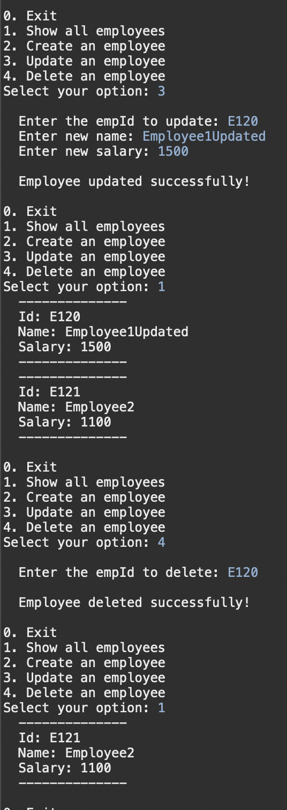

#### Write a program to insert, update and delete records from the given table.

##### Steps to create files

1. Open Eclipse IDE.
2. Go to File -> New -> Other....
3. Select Maven -> Maven Project and click Next.
4. Choose the option Create a simple project (skip archetype selection) and click Next.
5. Enter the Group Id (e.g., com.spring-mysql) and Artifact Id (e.g., spring-mysql) for your project. Click Finish.
6. Add this code to `pom.xml` file

```
<dependencies>
    <dependency>
        <groupId>org.springframework</groupId>
        <artifactId>spring-context</artifactId>
        <version>5.3.9</version>
    </dependency>

    <dependency>
        <groupId>org.springframework</groupId>
        <artifactId>spring-jdbc</artifactId>
        <version>5.3.14</version>
    </dependency>

    <dependency>
        <groupId>mysql</groupId>
        <artifactId>mysql-connector-java</artifactId>
        <version>8.0.27</version>
    </dependency>
</dependencies>
```

##### Code

```
Create new Java classes in the src/main/java directory

// Main.java

import org.springframework.context.ApplicationContext;
import org.springframework.context.annotation.AnnotationConfigApplicationContext;

import java.util.List;
import java.util.Scanner;

public class Main {

    public static void main(String[] args) {
        // Load the Spring application context
        ApplicationContext context = new AnnotationConfigApplicationContext(AppConfig.class);

        // Get the EmployeeeService bean
        EmployeeService employeeService = context.getBean(EmployeeService.class);

        Integer option = -1;
        Scanner scanner = new Scanner(System.in);

        do {
            System.out.println("0. Exit");
            System.out.println("1. Show all employees");
            System.out.println("2. Create an employee");
            System.out.println("3. Update an employee");
            System.out.println("4. Delete an employee");
            System.out.print("Select your option: ");

            option = scanner.nextInt();

            switch(option) {
                case 1: loadEmployees(employeeService);
                        break;

                case 2: createEmployee(employeeService, scanner);
                        break;

                case 3: updateEmployee(employeeService, scanner);
                        break;

                case 4: deleteEmployee(employeeService, scanner);
                        break;

                default: break;
            }

        } while(option != 0);

        System.out.println("Thank you!!");

        scanner.close();
    }

    private static void loadEmployees(EmployeeService employeeService) {
    	List<Employee> employees = employeeService.read();

    	if(employees.isEmpty()) {
            System.out.println();
            System.out.println("  No Data");
            System.out.println();
    	} else {
            for (Employee employee : employees) {
                System.out.println("  --------------");
                System.out.println("  Id: " + employee.getEmpId());
                System.out.println("  Name: " + employee.getName());
                System.out.println("  Salary: " + employee.getSalary());
                System.out.println("  --------------");
            }
    	    System.out.println();
    	}
    }

    private static void createEmployee(EmployeeService employeeService, Scanner scanner) {
    	System.out.println();

    	System.out.print("  Enter empId: ");
        String empId = scanner.next();

        System.out.print("  Enter name: ");
        String name = scanner.next();

        System.out.print("  Enter salary: ");
        Integer salary = scanner.nextInt();

        // Add a new employee
        employeeService.add(empId, name, salary);

        System.out.println();

        System.out.println("  Employee added successfully!");

        System.out.println();
    }

    private static void updateEmployee(EmployeeService employeeService, Scanner scanner) {
    	System.out.println();

    	System.out.print("  Enter the empId to update: ");
        String empId = scanner.next();

        System.out.print("  Enter new name: ");
        String name = scanner.next();

        System.out.print("  Enter new salary: ");
        Integer salary = scanner.nextInt();

        // Update the employee
        employeeService.update(empId, name, salary);

        System.out.println();

        System.out.println("  Employee updated successfully!");

        System.out.println();
    }

    private static void deleteEmployee(EmployeeService employeeService, Scanner scanner) {
    	System.out.println();

    	System.out.print("  Enter the empId to delete: ");

    	String empId = scanner.next();

        // Delete the employee
        employeeService.delete(empId);

        System.out.println();

        System.out.println("  Employee deleted successfully!");

        System.out.println();
    }
}


//AppConfig.java

import org.springframework.context.annotation.Bean;
import org.springframework.context.annotation.ComponentScan;
import org.springframework.context.annotation.Configuration;
import org.springframework.jdbc.core.JdbcTemplate;
import org.springframework.jdbc.datasource.DriverManagerDataSource;

import javax.sql.DataSource;

@Configuration
@ComponentScan(basePackages = "your.package")
public class AppConfig {

    @Bean
    public DataSource dataSource() {
        DriverManagerDataSource dataSource = new DriverManagerDataSource();
        dataSource.setDriverClassName("com.mysql.cj.jdbc.Driver");
        dataSource.setUrl("jdbc:mysql://localhost:3306/employees");
        dataSource.setUsername("root");
        dataSource.setPassword("");
        return dataSource;
    }

    @Bean
    public JdbcTemplate jdbcTemplate(DataSource dataSource) {
        return new JdbcTemplate(dataSource);
    }

    @Bean
    public EmployeeDao employeeDao(JdbcTemplate jdbcTemplate) {
        return new EmployeeDao(jdbcTemplate);
    }

    @Bean
    public EmployeeService employeeService(EmployeeDao employeeDao) {
        return new EmployeeService(employeeDao);
    }
}


//EmployeeService.java

import java.util.List;

import org.springframework.beans.factory.annotation.Autowired;
import org.springframework.stereotype.Service;

@Service
public class EmployeeService {

    @Autowired
    private EmployeeDao employeeDao;

    public EmployeeService(EmployeeDao employeeDao2) {
        // TODO Auto-generated constructor stub
    }

    public List<Employee> read() {
        return employeeDao.read();
    }

    public void add(String empId, String name, Integer salary) {
        employeeDao.insert(empId, name, salary);
    }

    public void update(String empId, String name, Integer salary) {
        employeeDao.update(empId, name, salary);
    }

    public void delete(String empId) {
        employeeDao.delete(empId);
    }
}


// EmployeeDao,java

import java.util.List;

import org.springframework.beans.factory.annotation.Autowired;
import org.springframework.jdbc.core.BeanPropertyRowMapper;
import org.springframework.jdbc.core.JdbcTemplate;
import org.springframework.stereotype.Component;

@Component
public class EmployeeDao{

    @Autowired
    private JdbcTemplate jdbcTemplate;

    public EmployeeDao(JdbcTemplate jdbcTemplate2) {
        // TODO Auto-generated constructor stub
    }

    public List<Employee> read() {
        return (List<Employee>) jdbcTemplate.query("SELECT * FROM employees", new BeanPropertyRowMapper<>(Employee.class));
    }

    public void insert(String empId, String name, Integer salary) {
        jdbcTemplate.update("INSERT INTO employees (empId, name, salary) VALUES (?, ?, ?)", empId, name, salary);
    }

    public void update(String empId, String name, Integer salary) {
        jdbcTemplate.update("UPDATE employees SET name = ?, salary = ? WHERE empId = ?", name, salary, empId);
    }

    public void delete(String empId) {
        jdbcTemplate.update("DELETE FROM employees WHERE empId = ?", empId);
    }
}


// Employee.java

public class Employee {
    String empId;
    String name;
    Integer salary;

    public String getEmpId() {
        return this.empId;
    }

    public String getName() {
        return this.name;
    }

    public Integer getSalary() {
        return this.salary;
    }

    public void setEmpId(String empId) {
        this.empId = empId;
    }

    public void setName(String name) {
        this.name = name;
    }

    public void setSalary(Integer salary) {
        this.salary = salary;
    }
}
```

##### Output

1. Right-click on the `Main.java` file.
2. Select Run As -> Java Application.



