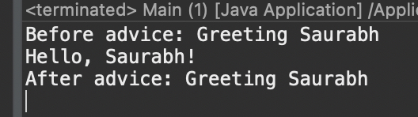
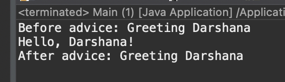

#### Write a program to demonstrate Spring AOP before advice.

##### Steps to create files

1. Open Eclipse IDE.
2. Go to File -> New -> Other....
3. Select Maven -> Maven Project and click Next.
4. Choose the option Create a simple project (skip archetype selection) and click Next.
5. Enter the Group Id (e.g., com.spring-aop) and Artifact Id (e.g., spring-aop) for your project. Click Finish.
6. Add this code to `pom.xml` file

```
<dependencies>
    <dependency>
        <groupId>org.springframework</groupId>
        <artifactId>spring-context</artifactId>
        <version>6.1.3</version>
    </dependency>

    <dependency>
        <groupId>org.springframework</groupId>
        <artifactId>spring-aspects</artifactId>
        <version>6.1.3</version>
    </dependency>
</dependencies>
```

##### Code

```
Create new Java classes in the src/main/java directory

// Greeting.java

public class Greeting {
	public void greet(String name) {
		System.out.println("Hello, " + name + "!");
	}
}

// GreetingAop.java

import org.aspectj.lang.JoinPoint;
import org.aspectj.lang.annotation.After;
import org.aspectj.lang.annotation.Aspect;
import org.aspectj.lang.annotation.Before;

@Aspect
public class GreetingAop {

	@Before("execution (* Greeting.greet(..)) && args(name)")
	public void beforeAdvice(JoinPoint joinPoint, String name) {
		System.out.println("Before advice: Greeting " + name);
	}

	@After("execution (* Greeting.greet(..)) && args(name)")
	public void afterAdvice(JoinPoint joinPoint, String name) {
		System.out.println("After advice: Greeting " + name);
	}
}

// AppConfig.java

import org.springframework.context.annotation.Bean;
import org.springframework.context.annotation.ComponentScan;
import org.springframework.context.annotation.Configuration;
import org.springframework.context.annotation.EnableAspectJAutoProxy;

@Configuration
@EnableAspectJAutoProxy
public class AppConfig {
	@Bean
	public Greeting greeting() {
		return new Greeting();
	}

	@Bean
	public GreetingAop greetingAop() {
		return new GreetingAop();
	}
}

// Main.java

import org.springframework.context.ApplicationContext;
import org.springframework.context.annotation.AnnotationConfigApplicationContext;

public class Main {
	public static void main(String[] args) {
		ApplicationContext context = new AnnotationConfigApplicationContext(AppConfig.class);

		Greeting greeting = (Greeting) context.getBean(Greeting.class);

		greeting.greet("Saurabh");
	}
}
```

##### Output

1. Right-click on the `Main.java` file.
2. Select Run As -> Java Application.



