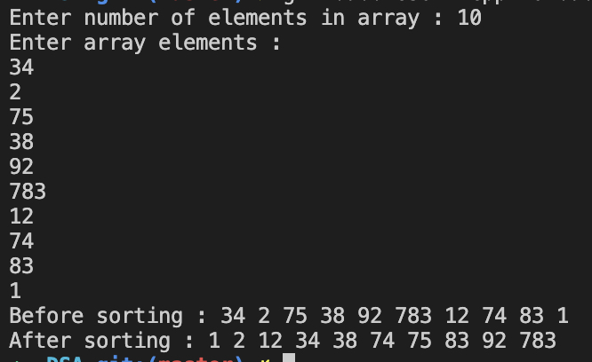

#### Bubble sort

##### To run the code

`g++ bubbleSort.cpp -o bubbleSort && ./bubbleSort`

##### Code

```
//bubbleSort.cpp

#include <iostream>

using namespace std;

void display(int arr[], int size)
{
    for (int i = 0; i < size; i++)
    {
        cout << arr[i] << " ";
    }

    cout << endl;
}

void sort(int arr[], int size)
{
    for (int i = 0; i < size; i++)
    {
        for (int j = i + 1; j < size; j++)
        {
            if (arr[i] > arr[j])
            {
                int t = arr[i];
                arr[i] = arr[j];
                arr[j] = t;
            }
        }
    }
}

int main()
{
    cout << "Enter number of elements in array : ";

    int size;

    cin >> size;

    int arr[size];

    cout << "Enter array elements : " << endl;

    for (int i = 0; i < size; i++)
    {
        cin >> arr[i];
    }

    cout << "Before sorting : ";

    display(arr, size);

    cout << "After sorting : ";

    sort(arr, size);

    display(arr, size);

    return 0;
}
```

##### Output


