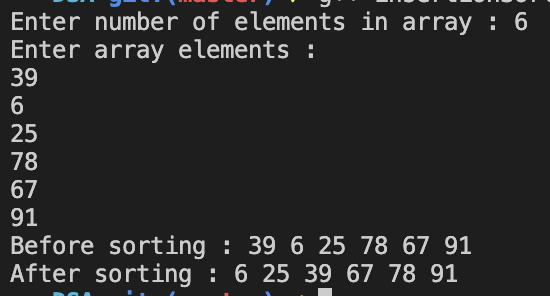

#### Insertion sort

##### To run the code

`g++ insertionSort.cpp  -o insertionSort && ./insertionSort`

##### Code

```
//insertionSort.cpp

#include <iostream>

using namespace std;

void display(int arr[], int size)
{
    for (int i = 0; i < size; i++)
    {
        cout << arr[i] << " ";
    }

    cout << endl;
}

void sort(int arr[], int size)
{
    for (int i = 1; i < size; i++)
    {
        int currentValue = arr[i];

        int j = i - 1;
        while (j >= 0 && arr[j] > currentValue)
        {
            arr[j + 1] = arr[j];

            j--;
        }

        arr[j + 1] = currentValue;
    }

    display(arr, size);
}

int main()
{
    cout << "Enter number of elements in array : ";

    int size;

    cin >> size;

    int arr[size];

    cout << "Enter array elements : " << endl;

    for (int i = 0; i < size; i++)
    {
        cin >> arr[i];
    }

    cout << "Before sorting : ";

    display(arr, size);

    cout << "After sorting : ";

    sort(arr, size);

    return 0;
}
```

##### Output


