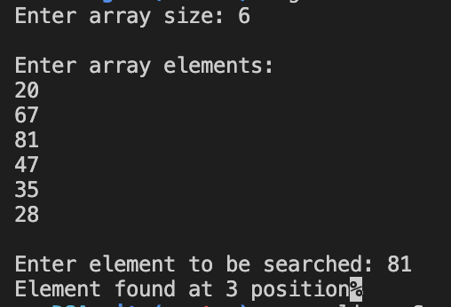
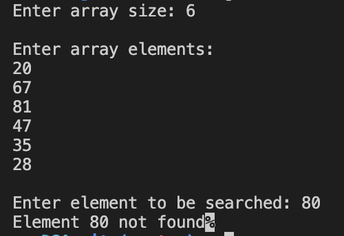

#### Linear search

##### To run the code

`g++ linearSearch.cpp  -o linearSearch && ./linearSearch`

##### Code

```
//linearSearch.cpp

#include <iostream>

using namespace std;

int linearSearch(int arr[], int size, int k)
{
    for (int i = 0; i < size; i++)
    {
        if (arr[i] == k)
        {
            return i;
        }
    }

    return -1;
}

int main()
{
    cout << "Enter array size: ";

    int size;

    cin >> size;

    int arr[size];

    cout << endl
         << "Enter array elements: " << endl;

    for (int i = 0; i < size; i++)
    {
        cin >> arr[i];
    }

    cout << endl
         << "Enter element to be searched: ";

    int k;

    cin >> k;

    int result = linearSearch(arr, size, k);

    if (result == -1)
    {
        cout << "Element " << k << " not found";
    }
    else
    {
        cout << "Element found at " << (result + 1) << " position";
    }

    return 0;
}
```

##### Output



