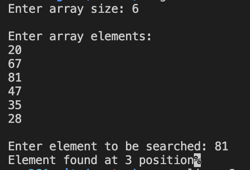
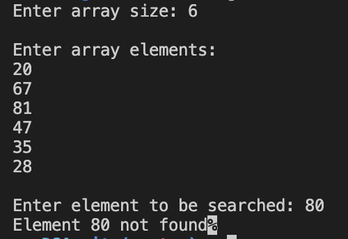

#### Binary search

##### To run the code

`g++ binarySearch.cpp -o binarySearch && ./binarySearch`

##### Code

```
//binarySearch.cpp

#include <iostream>

using namespace std;

void sortArray(int arr[], int size)
{
    for (int i = 0; i < size; i++)
    {
        for (int j = i + 1; j < size; j++)
        {
            if (arr[i] > arr[j])
            {
                int t = arr[i];
                arr[i] = arr[j];
                arr[j] = t;
            }
        }
    }
}

int binarySearch(int arr[], int k, int start, int last)
{
    if (last < start)
    {
        return -1;
    }

    int mid = start + ((last - start) / 2);

    if (arr[mid] == k)
    {
        return mid;
    }

    if (arr[mid] < k)
    {
        return binarySearch(arr, k, mid + 1, last);
    }

    return binarySearch(arr, k, start, mid - 1);
}

int main()
{
    cout << "Enter array size: ";

    int size;

    cin >> size;

    int arr[size];

    cout << endl
         << "Enter array elements: " << endl;

    for (int i = 0; i < size; i++)
    {
        cin >> arr[i];
    }

    cout << endl
         << "Enter element to be searched: ";

    int k;

    cin >> k;

    sortArray(arr, size);

    int result = binarySearch(arr, k, 0, size);

    cout << (result == -1 ? "Element " + to_string(k) + " not found" : "Element found at " + to_string(result + 1) + " position");

    return 0;
}
```

##### Output



