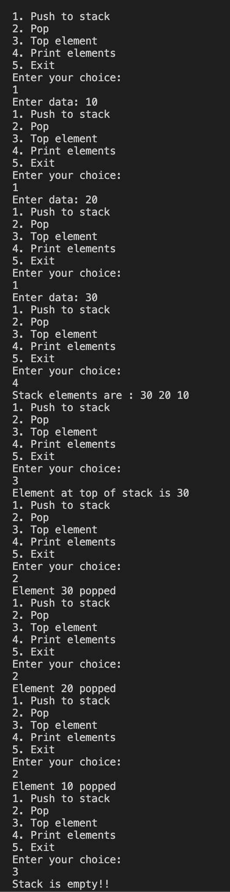

#### Implement Stack using array

##### To run the code

`g++ stackArray.cpp  -o stackArray && ./stackArray`

##### Code

```
//stackArray.cpp

#include <iostream>

using namespace std;

#define MAX 20

class Stack
{
private:
    int stack[MAX];

    int top;

public:
    Stack()
    {
        top = -1;

        for (int i = 0; i < MAX; i++)
        {
            stack[i] = -1;
        }
    }

    void push()
    {
        if (isFull())
        {
            cout << "Stack overflow!!" << endl;

            return;
        }

        int element;

        cout << "Enter data: ";

        cin >> element;

        top++;

        stack[top] = element;
    }

    int pop()
    {
        if (isEmpty())
        {
            cout << "Stack underflow!!" << endl;

            return -1;
        }

        int del = stack[top];

        top--;

        cout << "Element " << del << " popped" << endl;

        return del;
    }

    void print()
    {
        if (isEmpty())
        {
            cout << "Stack is empty!!" << endl;

            return;
        }

        cout << "Stack elements are : ";

        for (int i = top; i >= 0; i--)
        {
            cout << stack[i] << " ";
        }

        cout << endl;
    }

    bool isFull()
    {
        return top == MAX - 1;
    }

    bool isEmpty()
    {
        return top == -1;
    }

    int topElement()
    {
        if (isEmpty())
        {
            cout << "Stack is empty!!" << endl;

            return -1;
        }

        cout << "Element at top of stack is " << stack[top] << endl;

        return stack[top];
    }
};

int main()
{
    Stack stack;

    int menu;

    while (1)
    {
        cout << "1. Push to stack" << endl;
        cout << "2. Pop" << endl;
        cout << "3. Top element" << endl;
        cout << "4. Print elements" << endl;
        cout << "5. Exit" << endl;
        cout << "Enter your choice: " << endl;

        cin >> menu;

        switch (menu)
        {
        case 1:
            stack.push();
            break;

        case 2:
            stack.pop();
            break;

        case 3:
            stack.topElement();
            break;

        case 4:
            stack.print();
            break;

        default:
            exit(0);
            break;
        }
    }

    return 0;
}
```

##### Output


