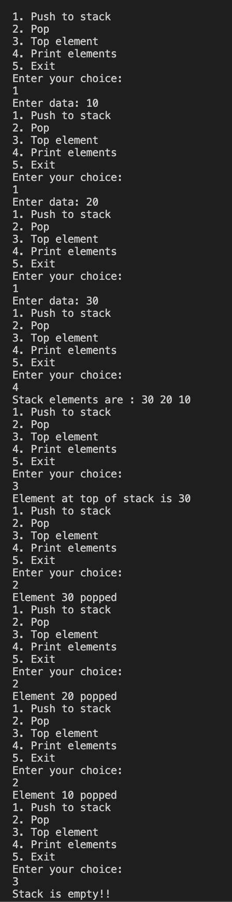

#### Implement Stack using linkedlist

##### To run the code

`g++ stackLinkedList.cpp  -o stackLinkedList && ./stackLinkedList`

##### Code

```
//stackLinkedList.cpp

#include <iostream>

using namespace std;

struct Node
{
    int data;
    Node *addr;
};

class Stack
{
private:
    Node *top;

public:
    Stack()
    {
        top = NULL;
    }

    void push()
    {
        int element;

        cout << "Enter data: ";

        cin >> element;

        Node *temp = new Node();

        temp->data = element;

        temp->addr = top;

        top = temp;
    }

    int pop()
    {
        if (isEmpty())
        {
            cout << "Stack underflow!!" << endl;

            return -1;
        }

        int del = top->data;

        Node *ptr = top;

        top = top->addr;

        delete (ptr);

        cout << "Element " << del << " popped" << endl;

        return del;
    }

    void print()
    {
        if (isEmpty())
        {
            cout << "Stack is empty!!" << endl;

            return;
        }

        cout << "Stack elements are : ";

        Node *head = top;

        while (head != NULL)
        {
            cout << head->data << " ";

            head = head->addr;
        }

        cout << endl;
    }

    bool isEmpty()
    {
        return top == NULL;
    }

    int topElement()
    {
        if (isEmpty())
        {
            cout << "Stack is empty!!" << endl;

            return -1;
        }

        cout << "Element at top of stack is " << top->data << endl;

        return top->data;
    }
};

int main()
{
    Stack stack;

    int menu;

    while (1)
    {
        cout << "1. Push to stack" << endl;
        cout << "2. Pop" << endl;
        cout << "3. Top element" << endl;
        cout << "4. Print elements" << endl;
        cout << "5. Exit" << endl;
        cout << "Enter your choice: " << endl;

        cin >> menu;

        switch (menu)
        {
        case 1:
            stack.push();
            break;

        case 2:
            stack.pop();
            break;

        case 3:
            stack.topElement();
            break;

        case 4:
            stack.print();
            break;

        default:
            exit(0);
            break;
        }
    }

    return 0;
}
```

##### Output


