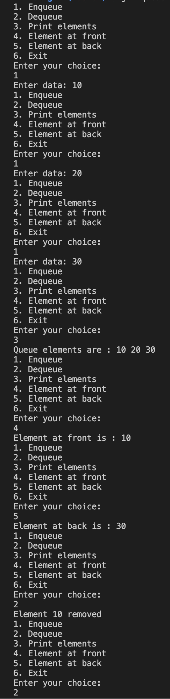
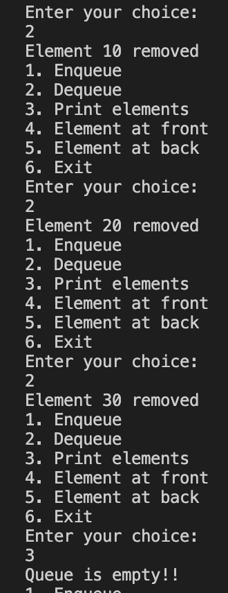

#### Implement queue using array

##### To run the code

`g++ queueArray.cpp  -o queueArray && ./queueArray`

##### Code

```
//queueArray.cpp

#include <iostream>

using namespace std;

#define MAX 5

class Queue
{
private:
    int queue[MAX];

    int front, rear;

public:
    Queue()
    {
        front = -1;
        rear = -1;

        for (int i = 0; i < MAX; i++)
        {
            queue[i] = -1;
        }
    }

    void enqueue()
    {
        if (isFull())
        {
            cout << "Queue overflow!!" << endl;

            return;
        }

        int element;

        cout << "Enter data: ";

        cin >> element;

        if (front == -1)
        {
            front = 0;
        }

        rear++;

        queue[rear] = element;
    }

    int dequeue()
    {
        if (isEmpty())
        {
            cout << "Queue is empty!!" << endl;

            return -1;
        }

        int del = queue[front];

        front++;

        cout << "Element " << del << " removed" << endl;

        return del;
    }

    void print()
    {
        if (isEmpty())
        {
            cout << "Queue is empty!!" << endl;

            return;
        }

        cout << "Queue elements are : ";

        for (int i = front; i <= rear; i++)
        {
            cout << queue[i] << " ";
        }

        cout << endl;
    }

    bool isFull()
    {
        return rear == MAX - 1;
    }

    bool isEmpty()
    {
        return front == -1 || front > rear;
    }

    void frontEl()
    {
        if (isEmpty())
        {
            cout << "Queue is empty!!" << endl;
            return;
        }

        cout << "Element at front is : " << queue[front] << endl;
    }

    void back()
    {
        if (isEmpty())
        {
            cout << "Queue is empty!!" << endl;
            return;
        }

        cout << "Element at back is : " << queue[rear] << endl;
    }
};

int main()
{
    Queue queue;

    int menu;

    while (1)
    {
        cout << "1. Enqueue" << endl;
        cout << "2. Dequeue" << endl;
        cout << "3. Print elements" << endl;
        cout << "4. Element at front" << endl;
        cout << "5. Element at back" << endl;
        cout << "6. Exit" << endl;
        cout << "Enter your choice: " << endl;

        cin >> menu;

        switch (menu)
        {
        case 1:
            queue.enqueue();
            break;

        case 2:
            queue.dequeue();
            break;

        case 3:
            queue.print();
            break;

        case 4:
            queue.frontEl();
            break;

        case 5:
            queue.back();
            break;

        default:
            exit(0);
            break;
        }
    }

    return 0;
}
```

##### Output



