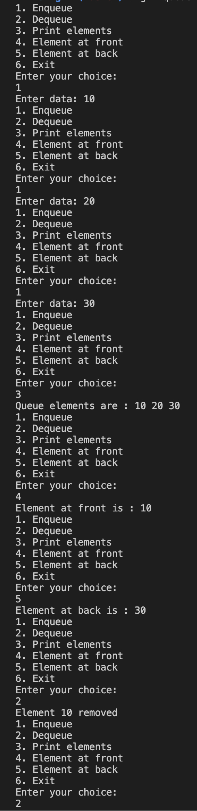
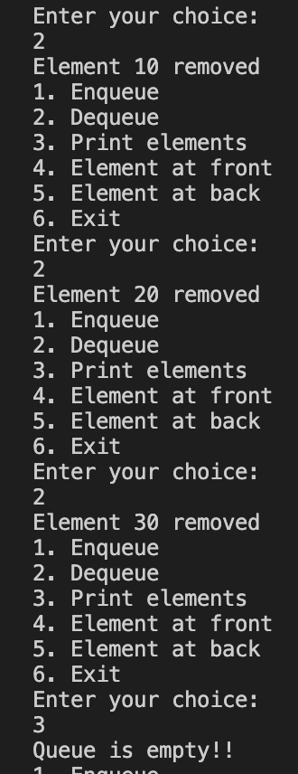

#### Implement queue using linkedlist

##### To run the code

`g++ queueLinkedList.cpp  -o queueLinkedList && ./queueLinkedList`

##### Code

```
//queueLinkedList.cpp

#include <iostream>

using namespace std;

struct Node
{
    int data;
    Node *addr;
};

class Queue
{
private:
    Node *front;
    Node *rear;

public:
    Queue()
    {
        front = NULL;
        rear = NULL;
    }

    void enqueue()
    {
        int element;

        cout << "Enter data: ";

        cin >> element;

        Node *temp = new Node();

        temp->data = element;

        temp->addr = NULL;

        if (rear != NULL)
        {
            rear->addr = temp;
        }

        rear = temp;

        if (front == NULL)
        {
            front = temp;
        }
    }

    int dequeue()
    {
        if (isEmpty())
        {
            cout << "Queue underflow!!" << endl;

            return -1;
        }

        int del = front->data;

        Node *ptr = front;

        front = front->addr;

        delete (ptr);

        cout << "Element " << del << " removed" << endl;

        return del;
    }

    void print()
    {
        if (isEmpty())
        {
            cout << "Queue is empty!!" << endl;

            return;
        }

        cout << "Queue elements are : ";

        Node *head = front;

        while (head != NULL)
        {
            cout << head->data << " ";

            head = head->addr;
        }

        cout << endl;
    }

    bool isEmpty()
    {
        return front == NULL;
    }

    void frontEl()
    {
        if (isEmpty())
        {
            cout << "Queue is empty!!" << endl;
            return;
        }

        cout << "Element at front is : " << front->data << endl;
    }

    void backEl()
    {
        if (isEmpty())
        {
            cout << "Queue is empty!!" << endl;
            return;
        }

        cout << "Element at back is : " << rear->data << endl;
    }
};

int main()
{
    Queue queue;

    int menu;

    while (1)
    {
        cout << "1. Enqueue" << endl;
        cout << "2. Dequeue" << endl;
        cout << "3. Print elements" << endl;
        cout << "4. Element at front" << endl;
        cout << "5. Element at back" << endl;
        cout << "6. Exit" << endl;
        cout << "Enter your choice: " << endl;

        cin >> menu;

        switch (menu)
        {
        case 1:
            queue.enqueue();
            break;

        case 2:
            queue.dequeue();
            break;

        case 3:
            queue.print();
            break;

        case 4:
            queue.frontEl();
            break;

        case 5:
            queue.backEl();
            break;

        default:
            exit(0);
            break;
        }
    }

    return 0;
}
```

##### Output



