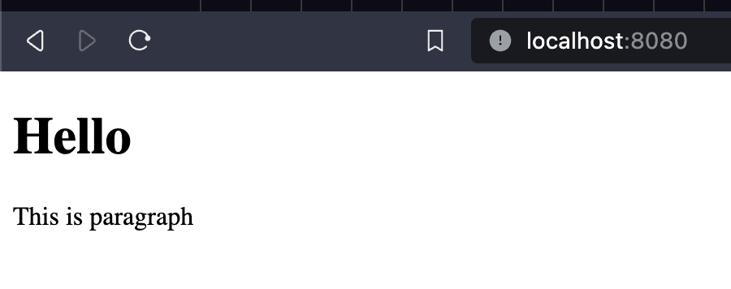

#### NodeJS file handling

##### To run the application

`node index.js`

##### Code

```
//index.js

const http = require('http');
const fs = require('fs');

http
  .createServer(function (req, res) {
    fs.readFile('index.html', function (err, data) {
      res.writeHead(200, { 'Content-Type': 'text/html' });
      res.write(data);
      return res.end();
    });
  })
  .listen(8080);

//index.html

<!DOCTYPE html>
<html lang="en">
<head>
    <meta charset="UTF-8">
    <meta name="viewport" content="width=device-width, initial-scale=1.0">
    <title>Demo application</title>
</head>
<body>
    <h1>Hello</h1>
    <p>This is paragraph</p>
</body>
</html>
```

##### Output


