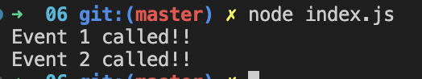

#### Events

##### Code

```
const event = require('events');

const emitter = new event.EventEmitter();

const event1Handler = () => console.log('Event 1 called!!');
const event2Handler = () => console.log('Event 2 called!!');

emitter.on('event1', event1Handler);
emitter.on('event2', event2Handler);

emitter.emit('event1');
emitter.emit('event2');
```

##### Output


