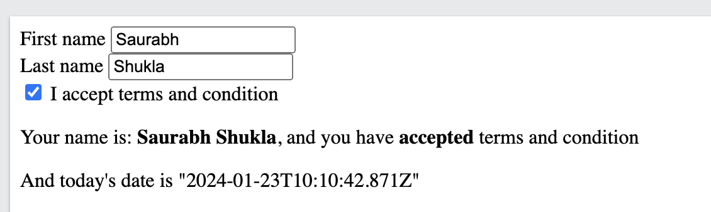

#### Angular form

##### Code

```
<!DOCTYPE html>
<html lang="en">
  <head>
    <meta charset="UTF-8" />
    <meta
      name="viewport"
      content="width=device-width, initial-scale=1.0"
    />
    <title>Angular forms</title>
    <style>
      span {
        font-weight: bold;
      }
    </style>
  </head>

  <body ng-app>
    <section>
      <form>
        <div>
          <label for="firstName">First name</label>
          <input
            type="text"
            id="firstName"
            ng-model="firstName"
            autofocus
          />
        </div>
        <div>
          <label for="lastName">Last name</label>
          <input
            type="text"
            id="lastName"
            ng-model="lastName"
          />
        </div>
        <div>
          <input
            type="checkbox"
            id="terms"
            ng-model="terms"
          />
          <label for="terms">I accept terms and condition</label>
        </div>
      </form>

      <p>
        Your name is:
        <span>{{ firstName }} <span ng-bind="lastName"></span></span>, and you
        have <span>{{ terms ? ' accepted' : ' not accepted' }}</span> terms and
        condition
      </p>
    </section>

    <script src="https://ajax.googleapis.com/ajax/libs/angularjs/1.8.3/angular.min.js"></script>
  </body>
</html>
```

##### Output


