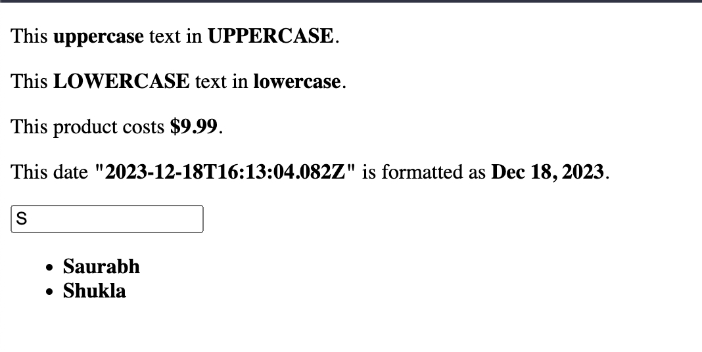

#### Angular filters

##### Code

```
<!DOCTYPE html>
<html lang="en">
  <head>
    <meta charset="UTF-8" />
    <meta
      name="viewport"
      content="width=device-width, initial-scale=1.0"
    />
    <title>Angular forms</title>
    <style>
      span {
        font-weight: bold;
      }
    </style>
  </head>
  <body ng-app="angular-app">
    <section ng-controller="filters-ctrl">
      <p>
        This <span>{{ uppercase }}</span> text in
        <span>{{ uppercase | uppercase }}</span>.
      </p>
      <p>
        This <span>{{ lowercase }}</span> text in
        <span>{{ lowercase | lowercase }}</span>.
      </p>
      <p>This product costs <span>{{ price | currency }}</span>.</p>
      <p>
        This date <span>{{ date }}</span> is formatted as
        <span>{{ date | date }}</span>.
      </p>
      <input
        type="text"
        ng-model="filter"
        placeholder="Type to filter names..."
        autofocus
      />
      <ul>
        <li ng-repeat="name in names | filter : filter">
          <span>{{ name }}</span>
        </li>
      </ul>
    </section>

    <script src="https://ajax.googleapis.com/ajax/libs/angularjs/1.8.3/angular.min.js"></script>

    <script>
      const app = angular.module('angular-app', []);

      app.controller('filters-ctrl', ($scope) => {
        $scope.uppercase = 'uppercase';
        $scope.lowercase = 'LOWERCASE';
        $scope.price = 9.99;
        $scope.date = new Date();
        $scope.names = ['Jane', 'John', 'Doe', 'Dave', 'Saurabh', 'Shukla'];
      });
    </script>
  </body>
</html>

```

##### Output


