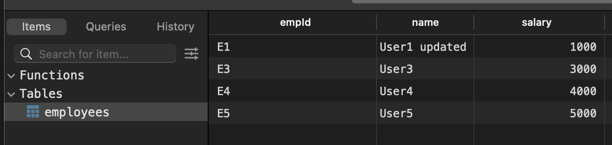

#### CRUDs

##### Code

```
//dbConnection.js
import mysql from 'mysql';

const DATABASE = 'employees';

const connection = mysql.createConnection({
  host: 'localhost',
  user: 'root',
  password: '',
  database: DATABASE,
});

connection.connect((err) => {
  if (err) {
    return console.log('Error cannot connect');
  }

  console.log(`Connected to ${DATABASE} database`);
});

export default connection;


//index.js

import connection from './dbConnection.js';

const TABLE = 'employees';

const displayData = (err, result) => {
  if (err) throw err;

  if (result?.length == 0) {
    console.log('No data');
    return;
  }

  console.table(result);
};

connection.query(`TRUNCATE ${TABLE}`);

const sampleData = (no) => ({
  empId: 'E' + no,
  name: 'User' + no,
  salary: no * 1000,
});

const EMPLOYEES = [];

for (let i = 1; i <= 5; i++) {
  EMPLOYEES.push(sampleData(i));

  connection.query(
    `INSERT INTO ${TABLE} (empId, name, salary) VALUES ('${
      EMPLOYEES[i - 1].empId
    }', '${EMPLOYEES[i - 1].name}', '${EMPLOYEES[i - 1].salary}')`,
    (err, result) => {
      if (err) throw err;
    }
  );
}

connection.query(`SELECT * FROM ${TABLE}`, displayData);

connection.query(
  `UPDATE ${TABLE} SET name = '${EMPLOYEES[0].name} updated' WHERE empId = '${EMPLOYEES[0].empId}'`
);

connection.query(`DELETE FROM ${TABLE} WHERE empId = '${EMPLOYEES[1].empId}'`);

connection.query(`SELECT * FROM ${TABLE}`, displayData);
```

##### Output



